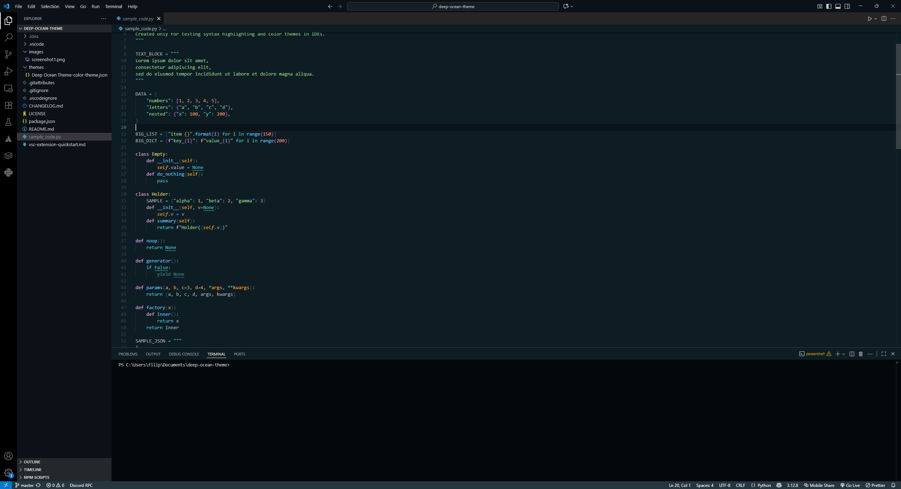

# Deep Ocean Theme
A Visual Studio Code theme inspired by the Deep Ocean Theme by Kostyantyn Safonov, originally designed for JetBrains IDEs. This theme aims to bring the same aesthetic and color scheme to VS Code users. At least that's the plan.

This is my first ever VS Code theme, don't expect too much :>.

(this screenhot is slightly outdated)

I'll try to add more screenshots in the future.

Original Deep Ocean Theme: https://github.com/KostyaSafonov/DeepOceanTheme